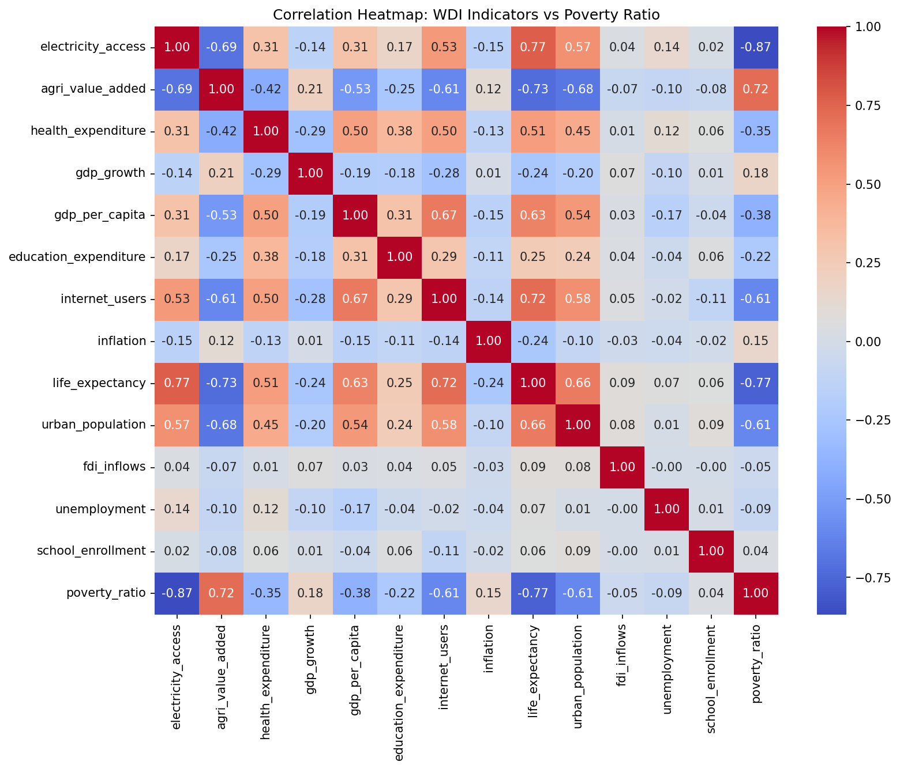
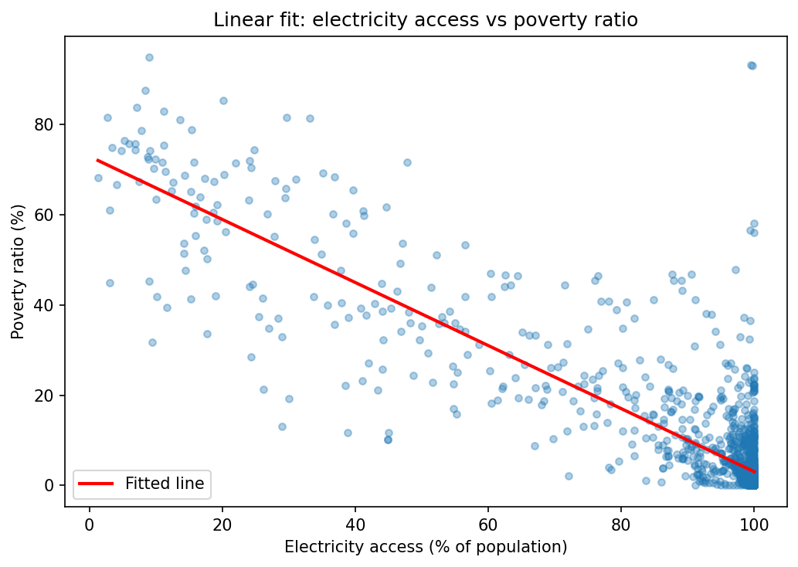
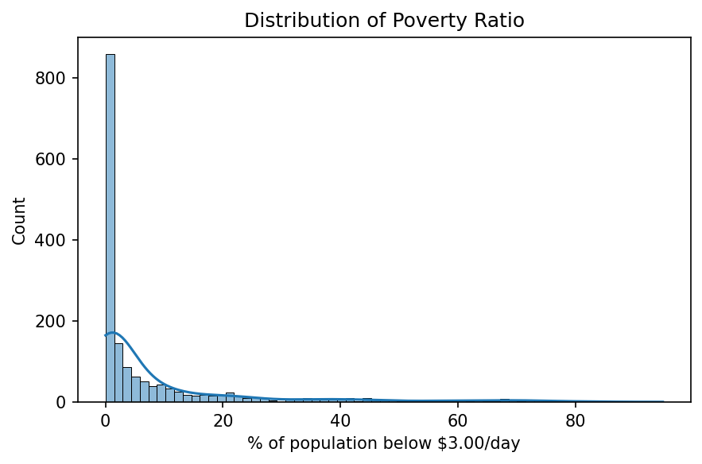
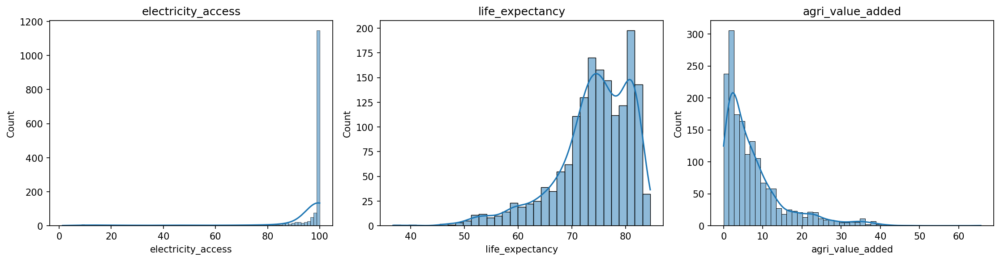
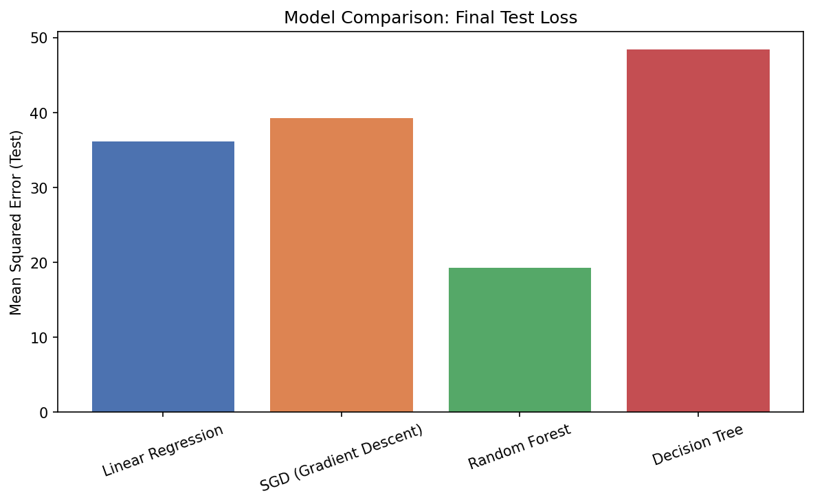
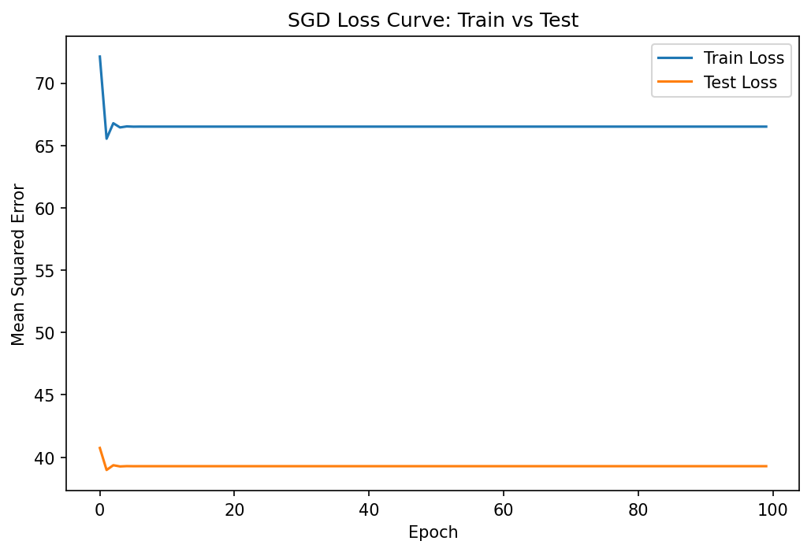

# Poverty Headcount Prediction

## Mission and Problem

Poverty persists across developing nations, yet the factors driving it are usually measured in isolation rather than together. This project models the poverty headcount ratio, the share of a population living below $3.00 a day, against economic, health, and infrastructure indicators. By quantifying which factors move poverty most, the model shows where intervention carries the greatest weight. The result is a deployed tool that predicts poverty levels from a country's development profile.

## Dataset

**Source:** [World Bank World Development Indicators](https://databank.worldbank.org/source/world-development-indicators), with region classifications from the [World Bank Country API](https://api.worldbank.org/v2/country).

**Description:** A country-year panel covering 2002 to 2022. After removing observations with no reported poverty figure, the dataset holds **1,671 country-year rows across 16 features**: ten continuous development indicators (electricity access, internet users, urban population, GDP per capita, GDP growth, inflation, agriculture value added, health expenditure, education expenditure, life expectancy) and six one-hot encoded World Bank regions.

**Target:** Poverty headcount ratio at $3.00 a day (2021 PPP), percentage of population.

### Data preparation

| Step | Decision | Reasoning |
|---|---|---|
| Reshape | Wide (year columns) to long (country-year rows) | Turns a single snapshot into a panel, raising volume from 268 to several thousand rows |
| Missing target | Rows dropped | Imputing a poverty value would mean training on invented labels |
| Missing predictors | Median fill | Economic indicators are heavily skewed; the median resists outliers better than the mean |
| Categorical conversion | Region one-hot encoded | The only genuine categorical in the data; encoded to numeric for modelling |
| Feature removal | `school_enrollment`, `fdi_inflows`, `unemployment` dropped | Near-zero correlation with the target (0.04, -0.05, -0.09) |
| Feature removal | `income_group` dropped | Derived from GNI, the same basis as poverty, so retaining it would leak the target |
| Scaling | `StandardScaler`, fitted on training data only | Prevents test-set information leaking into training |

## Visualisations

### Correlation heatmap


Electricity access is the strongest predictor at **-0.87**, followed by life expectancy at **-0.77**. Agricultural share of GDP is the strongest positive signal at **+0.72**. Poverty therefore tracks basic infrastructure and economic structure far more closely than headline GDP per capita (-0.38). Several predictors also correlate strongly with one another, life expectancy against electricity access at +0.77, indicating multicollinearity that a linear model handles poorly.

### Poverty against the strongest predictor

 
Electricity access alone traces a clear downward relationship with poverty, and the fitted line shows the trend a linear model captures. The spread around that line is what the tree-based models exploit: the relationship is directional but not tidy, especially at high access levels where poverty ranges from near zero to well above it.
 
### Target distribution

 
The target is heavily right-skewed. Most country-years cluster at low poverty with a long tail toward severe poverty, which means a linear model fitted on the raw target will be pulled by the tail and is one reason the tree ensemble performs better.
 
### Predictor distributions

 
The three strongest predictors sit on very different scales and shapes: electricity access piles up near 100%, life expectancy is roughly bell-shaped around 70 to 80 years, and agricultural share is right-skewed. Standardisation is applied before training so no feature dominates purely because its raw numbers are larger.

## Model Comparison


## Loss Curve

## Models

Four models were trained and compared on test-set loss.

| Model | MSE | RMSE |
|---|---|---|
| Random Forest | _[fill in]_ | _[fill in]_ |
| Linear Regression (closed form) | _[fill in]_ | _[fill in]_ |
| Linear Regression (SGD) | _[fill in]_ | _[fill in]_ |
| Decision Tree | _[fill in]_ | _[fill in]_ |

**Selection criterion:** lowest root mean squared error on the held-out test set.

**Why Random Forest won:** the heatmap showed both non-linear relationships and heavy overlap between predictors. Linear regression assumes a straight-line relationship and is destabilised by multicollinearity, which caps both linear implementations at a similar loss. A single decision tree captures non-linearity but overfits. Random Forest averages many trees, so it captures the non-linearity while controlling the variance that hurt the single tree. It is saved as `best_model.pkl` and serves the deployed API.

## API

**Base URL:** https://mlsummative-regression-analysis.onrender.com

**Swagger UI:** https://mlsummative-regression-analysis.onrender.com/docs

| Endpoint | Method | Purpose |
|---|---|---|
| `/` | GET | Service check |
| `/predict` | POST | Returns a predicted poverty ratio from eleven inputs |
| `/retrain` | POST | Accepts a CSV upload and retrains the deployed model |

**Validation:** every numeric input has an enforced type and a realistic range defined with Pydantic `Field` constraints (percentages bounded 0 to 100, inflation and GDP growth permitted to go negative, life expectancy bounded 20 to 90). Region is an enum, so only the seven valid World Bank regions are accepted. The API converts the region string into one-hot columns server-side, so callers never handle the encoding.

**CORS:** origins are restricted to the deployed domain and localhost rather than a wildcard. Methods are limited to GET and POST, headers to `Content-Type`, and credentials are disabled since the API uses no cookies or tokens. The principle is to permit only what the client actually needs.

> The free Render tier sleeps after inactivity. The first request may take 30 to 60 seconds while the service wakes.

## Video Demo

_[YouTube link]_

## Setup

Clone the repository first.

```bash
git clone https://github.com/teniolaiji/MLSummative-_Regression-Analysis.git
cd MLSummative-_Regression-Analysis
```

### Python environment (notebooks and API)

Dependencies are managed with [`uv`](https://docs.astral.sh/uv/). Install it if you do not have it:

```bash
# macOS / Linux
curl -LsSf https://astral.sh/uv/install.sh | sh

# Windows PowerShell
powershell -ExecutionPolicy ByPass -c "irm https://astral.sh/uv/install.ps1 | iex"

# or via pip, then call it with: python -m uv
pip install uv
```

Create the environment and install everything from `pyproject.toml`:

```bash
uv sync
```

Run the notebooks against that environment:

```bash
uv run jupyter notebook
```

Open `linear_regression/Cleaning.ipynb` first to produce `wdi_poverty_panel_clean.csv`, then `multivariate.ipynb` to train the models and write the `.pkl` artefacts.

### Running the API locally

The deployed API is already public, so this is only needed for local development. The API folder carries its own `requirements.txt`, which is what Render installs at build time.

```bash
cd API
pip install -r requirements.txt
uvicorn prediction:app --reload
```

Swagger UI is then at http://127.0.0.1:8000/docs.

Using `uv` instead:

```bash
uv run uvicorn API.prediction:app --reload
```

## Running the Mobile App

**Prerequisites:** Flutter SDK 3.0 or later, and either an Android emulator or a physical device with USB debugging enabled.

```bash
cd flutterapp
flutter pub get
flutter run
```

Enter a value in each of the ten indicator fields, choose a region, and tap **Predict poverty ratio**. Values outside their valid range are rejected in the app before any request is sent. The result appears as a percentage alongside a grid of 100 marks showing how many people in every hundred fall below the line.

The API address is set in `lib/main.dart` as `apiUrl`. Change it there to point at a different deployment.

## Repository Structure

```
.
├── linear_regression/
│   ├── Cleaning.ipynb              # reshaping, missing values, feature engineering
│   ├── multivariate.ipynb          # EDA, model training and comparison
│   ├── fetch_new_data.ipynb        # pulls recent data for retraining
│   ├── images/                     # plots referenced in this README
│   ├── wdi_poverty_panel_raw.csv
│   ├── wdi_poverty_panel_clean.csv
│   └── retrain_new_data.csv
├── API/
│   ├── prediction.py               # FastAPI app
│   ├── requirements.txt
│   ├── best_model.pkl
│   ├── scaler.pkl
│   └── feature_names.pkl
├── flutterapp/                     # Flutter mobile app
├── pyproject.toml
├── uv.lock
└── README.md
```
